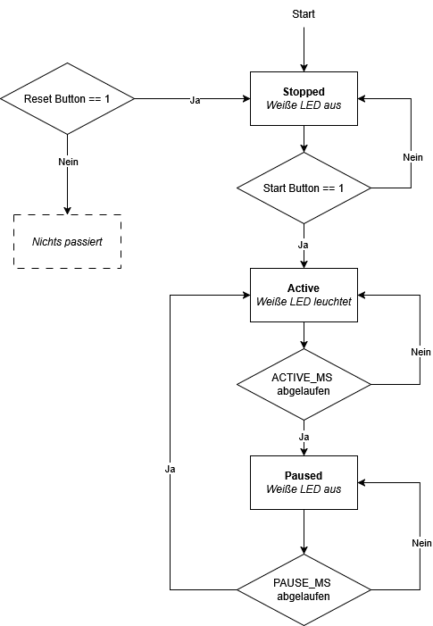
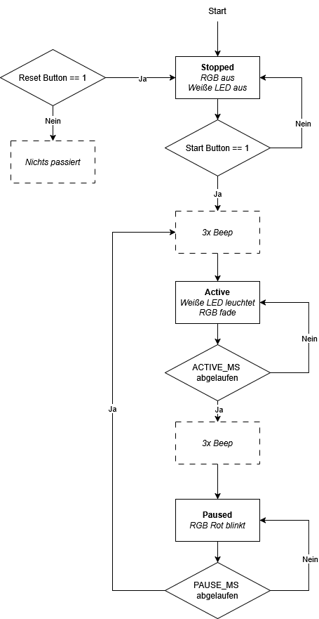

# Live Coding Session 01 Walkthrough
Hallo Studies
wir haben diesen Walkthrough für euch erstellt, da wir gemerkt haben, dass es bei der Coding Session oft das Problem gegeben hat, dass die Aufgaben leider nicht **chronologisch** abgearbeitet wurden und es somit zu **etweiligen Problemen** geführt hat.

Deshalb zeigen wir euch unseren **Workflow** nochmals, wie man solch eine Aufgabenstellung angeht und **final dann auch komplett löst.**

## Aufgabenstellung: Intervalltrainer mit LED, RGB und Buzzer

### Bauteile:
2× Buttons (Start + Reset)

1× LED (weiß)

1× RGB-LED

1× Buzzer

### Beschreibung
In dieser Session entwickelt ihr einen Intervalltrainer für Läufer:innen.
Das System zeigt optisch und akustisch an, wann eine Belastungsphase (Active) läuft und wann eine Pause eingelegt werden soll.
Die Steuerung erfolgt über einen Start-Button und einen Reset-Button.

- Start-Button: startet das Training
- Reset-Button: bricht das Training sofort ab und setzt das System zurück

### Ablauf & Verhalten (Code-Logik)

| Zustand         | Haupt-LED (weiß)                           | RGB-LED (R,G,B)                                      | Buzzer                                               | Übergang                                                                 |
|----------------- |-------------------------------------------|------------------------------------------------------|------------------------------------------------------|-------------------------------------------------------------------------|
| STOPPED         | Aus                                       | Aus                                                  | Aus                                                  | → Start-Button gedrückt → ACTIVE                                        |
| ACTIVE          | Dauerhaft an                              | Fadet kontinuierlich durch **alle Farben (*)**       | 3× Beep **zu Beginn** der Phase (*)                    | → Nach `ACTIVE_MS` abgelaufen → PAUSE                                   |
| ACTIVE (Ende)   | Aus (beim Übergang)                       | Fadet stoppt                                          | 3× Beep **am Ende** der Phase (*)                      | Wechselt in PAUSE                                                       |
| PAUSE           | Aus                                       | Blinkt **rot** (500 ms an / 500 ms aus) (*)          | Aus                                                  | → Nach `PAUSE_MS` abgelaufen → ACTIVE (mit 3× Beep am Start)             |
| RESET gedrückt  | Sofort Aus                                | Sofort Aus                                           | Sofort Aus                                            | Immer → STOPPED, Timer & Zähler reset                                   |

**Mit (*) markierte Funktionalität zählt zum "Zusatz" (40% der Bewertung). Alles andere zählt zur Grundfunktionalität (60% der Bewertung).**

### Wichtiger Hinweis – Live-Coding-Session
Hallo Studies,
für dieses Assignment reicht es nicht nur, den Code hochzuladen – ihr müsst uns auch in einer Live-Coding-Session zeigen, dass eure Lösung funktioniert.
Das bedeutet konkret:
- Ihr programmiert eure Lösung selbstständig und ladet wie gewohnt das main.py-File hoch.
- Zusätzlich müsst ihr eine Live-Demo eures Codes präsentieren, in der ihr zeigt, wie ihr euren Code startet, wie er funktioniert und dass die Anforderungen erfüllt sind.
- Ohne diese Live-Vorführung gilt die Coding Session nicht als vollständig abgeschlossen.
**Bitte achtet darauf, dass euer Setup (Board, Sensoren, LEDs, Buttons) vorbereitet ist, damit die Präsentation reibungslos abläuft.**

## Start und Konzept-Phase

ls aller Erstes ist es wichtig, dass ihr die **Aufgabenstellung genau durchlest** und zuerst einmal die **Minimalanforderungen identifiziert**.
So kann dann die Tabelle von oben sehr schnell vereinfacht werden, und man kommt zu der **vereinfachten Version**, nämlich dieser:

| Zustand         | Haupt-LED (weiß)                           | RGB-LED (R,G,B) | Buzzer     | Übergang                                                               |
|----------------- |-------------------------------------------|-----------------|------------|-----------------------------------------------------------------------|
| STOPPED         | Aus                                       | Aus             | Aus        | → Start-Button gedrückt → ACTIVE                                      |
| ACTIVE          | Dauerhaft an                              | Aus             | Aus        | → Nach `ACTIVE_MS` abgelaufen → PAUSE                                 |
| ACTIVE (Ende)   | Aus (beim Übergang)                       | Aus             | Aus        | Wechselt in PAUSE                                                     |
| PAUSE           | Aus                                       | Aus             | Aus        | → Nach `PAUSE_MS` abgelaufen           |
| RESET gedrückt  | Sofort Aus                                | Sofort Aus      | Sofort Aus | Immer → STOPPED, Timer & Zähler reset                                 |


So kann man sehen, dass es sich dabei eigentlich nur um eine **State Machine** mit den Zuständen **ACTIVE**, **PAUSE** und **STOPPED** handelt.

*Mit dieser vereinfachten Tabelle seht ihr klar die Grundlogik – ohne Zusatzfunktionen – und könnt darauf aufbauen, sobald die Basis sauber funktioniert.*

## Ablaufdiagram

Es kann oft von Vorteil sein, ein **Ablaufdiagram** zu zeichnen.
Dabei finde ich es immer ganz angenehm, wenn man das **von Hand zeichnet**,
da es sich während des Programmierens **weiterentwickelt** und man somit die Möglichkeit hat, dort immer noch etwas **hinzuzufügen oder zu verändern**.

Für die Minimal Anforderung wäre das:



Wenn alle Zusatzaufgaben erfüllt werden dann haben wir folgendes Ablaufdiagram



Im Ablaufdiagramm steht `if Button == 1`. Wie gewohnt, soll das einfach heißen, wenn der Button gedrückt wird. (Bei PULL_UP heißt das Fallende Flanke!)

## Wie fange ich an?

Da es am Anfang oft etwas schwer sein kann und es nicht gerade **logisch** ist, womit man beginnen sollte, würde ich euch empfehlen, wenn ihr eine **State Machine programmiert**, dass ihr **auch genau mit dieser beginnt**.

Es ist immer gut, wenn man sich eine **Variable** definiert, welche den **aktuellen State** beschreibt, da es so sehr einfach ist, im Code zu erkennen, in welchem Zustand sich das Programm gerade befindet und entsprechend darauf zu reagieren.

```python
from machine import Pin
import time

# Globale Variablen
## States
STOPPED = 1
ACTIVE = 2
PAUSE = 3

## Current State
current_state = 0 # Wir beginnen in dem einem undefinierten State!

while True:
    # ACHTUNG: sleep nur zu Debugging Zwecken!
    time.sleep(0.5)
```

Da wir nun die Variablen definiert haben, machen wir weiter, indem wir sagen, wir hätten für jeden State gerne eine **eigene Funktion**, welche wir analog zu den States benennen. Zusätzlich sagen wir, dass der State **STOPPED** einfach unser State ist, welcher immer zu Beginn ausgeführt werden soll.
Warum machen wir das? – Weil in diesem State einfach **nichts passieren soll**, und er sich somit super eignet, als **Initial State** verwendet zu werden.

**Remark:** Sollte es keinen State geben, in dem nichts passiert, dann macht euch einfach noch einen **zusätzlichen State** – oft wird dieser *Idle* genannt.

```python
from machine import Pin
import time

# Globale Variablen
## States
STOPPED = 1
ACTIVE = 2
PAUSE = 3

## Current State
current_state = STOPPED

def state_stopped(): # Funktion für den State stopped
    print("State: stopped")

def state_active(): # Funktion für den State active
    print("State: active")

def state_paused(): # Funktion für den State paused
    print("State: paused")


while True:
    # ACHTUNG: sleep nur zu Debugging Zwecken!
    time.sleep(0.5)
```

Da wir nun für jeden State eine Funktion haben, können wir uns nun um die **Übergänge** zwischen den einzelnen States kümmern.
Da wir eine **Variable** haben, welche uns sagt, welcher State gerade ausgeführt werden soll, können wir mit **if-Verzweigungen** arbeiten und so unsere **Übergänge genau definieren.**

```python
from machine import Pin
import time

# Globale Variablen
## States
STOPPED = 1
ACTIVE = 2
PAUSE = 3

## Current State
current_state = STOPPED

def state_stopped(): # Funktion für den State stopped
    print("State: stopped")

def state_active(): # Funktion für den State active
    print("State: active")

def state_paused(): # Funktion für den State paused
    print("State: paused")


while True:
    if current_state == STOPPED: # if Verzweigung welche die States hin und her schaltet
        state_stopped()
    elif current_state == ACTIVE:
        state_active()
    elif current_state == PAUSE:
        state_paused()
    # ACHTUNG: sleep nur zu Debugging Zwecken!
    time.sleep(0.5)
```

### Start-Button

So haben wir nun ein Programm, welches alle drei States, die wir haben, darstellt, und so können wir es auch verwenden.

Der erste **State-Übergang** ist dabei ein bisschen schwieriger, da wir nun auf den **Knopfdruck eines Buttons** warten müssen, um vom **STOPPED-State** in den **ACTIVE-State** zu wechseln.
Das bedeutet, wir implementieren einen **Interrupt**, welcher getriggert wird, wenn unser Start-Button gedrückt wurde.
Das können wir wie folgt machen:

```python
from machine import Pin
import time

# Globale Variablen
## States
STOPPED = 1
ACTIVE = 2
PAUSE = 3

## Current State
current_state = STOPPED

# Pins Initialisieren
start_btn = Pin(27, Pin.IN, Pin.PULL_UP) # Hier wird der Button intialisiert

# Interrupt Handler - Wichtig immer vor dem Anhängen des Interrupts definieren
def start_button(pin):
    print("Start button wurde gedrückt")
    global current_state # Macht dieser Variable für diese Funktion zugänglich
    if current_state == STOPPED:
        current_state = ACTIVE # Hier sagen wir das unser Interrupt die State Variable ändern soll

# Interrupts
start_btn.irq(trigger=Pin.IRQ_FALLING, handler=start_button) # So hängen wir einen Interrupt dem Pin an welche auslösen soll, wenn der Button gedrückt wird

# State Machine
def state_stopped():
    print("State: stopped")

def state_active():
    print("State: active")

def state_paused():
    print("State: paused")


while True:
    if current_state == STOPPED:
        state_stopped()
    elif current_state == ACTIVE:
        state_active()
    elif current_state == PAUSE:
        state_paused()
    # ACHTUNG: sleep nur zu Debugging Zwecken!
    time.sleep(0.5)
```

### ACTIVE -> PAUSE

Da wir nun den ersten Übergang definiert haben, kümmern wir uns um den **zweiten Übergang von ACTIVE zu PAUSE**.
Die Aufgabenstellung sagt, dass dieser Übergang passieren soll, **nachdem eine gewisse Anzahl an Millisekunden abgelaufen** ist.
Dafür sollen wir eine Variable definieren, welche `ACTIVE_MS` heißt. Diese bestimmt, **wie lange** die aktive Phase dauern soll.

Da wir also eine gewisse Zeit **warten müssen**, bevor der Übergang passieren darf, wissen wir, dass wir hierfür einen **Timer** benötigen.
Dieser kann wie folgt implementiert werden:

```python
from machine import Pin, Timer # Jetzt brauchen wir zusätzlich die Timer Library
import time

# Globale Variablen
## States
STOPPED = 1
ACTIVE = 2
PAUSE = 3

## Current State
current_state = STOPPED

# Time Variablen
ACTIVE_MS = 1000 # Hier Initialisieren wir die ms welche wir warten möchten -> 1 Sekunde

# Pins Initialisieren
start_btn = Pin(27, Pin.IN, Pin.PULL_UP)

# Timers
active_timer = Timer(0) # So sagen wir unserm ESP das er uns einen Timer erstellen soll mit dem namen active_timer

# Interrupt Handler
def start_button(pin):
    print("Start button wurde gedrückt")
    global current_state
    if current_state == STOPPED:
        current_state = ACTIVE
        active_timer.init(period=ACTIVE_MS, mode=Timer.ONE_SHOT, callback=active_done) # Hier starten wir nun den Timer, weil würden wir ihn nach dem Erstellen direkt starten dann würde dieser bevor der Button gedrückt wird starten, was wir ja nicht wollen

# Timer Callbacks
def active_done(pin): # Wir haben die callback active_done genannt, weil wenn der timer durchgelaufen ist, so wird diese callback funktion getriggert
    print("Timer active phase ist abgeschlossen")
    global current_state
    current_state = PAUSE

# Interrupts
start_btn.irq(trigger=Pin.IRQ_FALLING, handler=start_button)

# State Machine
def state_stopped():
    print("State: stopped")

def state_active():
    print("State: active")

def state_paused():
    print("State: paused")


while True:
    if current_state == STOPPED:
        state_stopped()
    elif current_state == ACTIVE:
        state_active()
    elif current_state == PAUSE:
        state_paused()
    # ACHTUNG: sleep nur zu Debugging Zwecken!
    time.sleep(0.5)
```

### PAUSED -> ACTIVE

Somit befinden wir uns nun im **State PAUSED**, und wir wissen aufgrund des **Ablaufdiagramms**, dass es danach wieder in den **State ACTIVE** gehen soll.
Dafür sollen wir eine gewisse Zeit warten – nämlich die **`PAUSE_MS`**.
Somit wissen wir, dass wir einen **weiteren Timer** benötigen.

```python
from machine import Pin, Timer
import time

# Globale Variablen
## States
STOPPED = 1
ACTIVE = 2
PAUSE = 3

## Current State
current_state = STOPPED

# Time Variablen
ACTIVE_MS = 1000
PAUSE_MS = 1000 # Hier Initialisieren wir die ms welche wir warten sollen in der Pause

# Pins Initialisieren
start_btn = Pin(27, Pin.IN, Pin.PULL_UP)

# Timers
active_timer = Timer(0)
pause_timer = Timer(1) # So sagen wir unserm ESP das er uns einen Timer erstellen soll mit dem namen pause_timer

# Interrupt Handler
def start_button(pin):
    print("Start button wurde gedrückt")
    global current_state
    if current_state == STOPPED:
        current_state = ACTIVE
        active_timer.init(period=ACTIVE_MS, mode=Timer.ONE_SHOT, callback=active_done)

# Timer Callbacks
def active_done(pin):
    print("Timer active phase ist abgeschlossen")
    global current_state
    current_state = PAUSE
    pause_timer.init(period=PAUSE_MS, mode=Timer.ONE_SHOT, callback=pause_done) # Hier Initialisieren wir den Timer, weil dieser soll laufen ab dem Zeitpunkt wo wir die aktive Phase abgeschlossen haben

def pause_done(pin): # Wir haben die callback pause_done genannt, weil wenn der timer durchgelaufen ist, so wird diese callback funktion getriggert
    print("Timer paused phase ist abgeschlossen")
    global current_state
    current_state = ACTIVE # Wir wollen wieder zurück in den active state
    active_timer.init(period=ACTIVE_MS, mode=Timer.ONE_SHOT, callback=active_done) # Hier dürfen wir nicht vergessen den Timer wieder zu starten sonst funktioniert nur der erste durchlauf und die darauffolgenden leider nicht

# Interrupts
start_btn.irq(trigger=Pin.IRQ_FALLING, handler=start_button)

# State Machine
def state_stopped():
    print("State: stopped")

def state_active():
    print("State: active")

def state_paused():
    print("State: paused")


while True:
    if current_state == STOPPED:
        state_stopped()
    elif current_state == ACTIVE:
        state_active()
    elif current_state == PAUSE:
        state_paused()
    # ACHTUNG: sleep nur zu Debugging Zwecken!
    time.sleep(0.5)
```

### Reset-Button

Da wir jetzt einige **Übergänge** definiert haben, können wir uns nun um den **zweiten Button** und dessen **Funktion** kümmern.
Dieser soll als **Reset-Button** dienen und den State einfach wieder auf **STOPPED** setzen.

Dieser kann wie folgt implementiert werden:

```python
from machine import Pin, Timer
import time

# Globale Variablen
## States
STOPPED = 1
ACTIVE = 2
PAUSE = 3

## Current State
current_state = STOPPED

# Time Variablen
ACTIVE_MS = 1000
PAUSE_MS = 1000

# Pins Initialisieren
start_btn = Pin(27, Pin.IN, Pin.PULL_UP)
reset_btn = Pin(26, Pin.IN, Pin.PULL_UP) # Hier initialisieren wir nun den RESET Button

# Timers
active_timer = Timer(0)
pause_timer = Timer(1)

# Interrupt Handler
def start_button(pin):
    print("Start button wurde gedrückt")
    global current_state
    if current_state == STOPPED:
        current_state = ACTIVE
        active_timer.init(period=ACTIVE_MS, mode=Timer.ONE_SHOT, callback=active_done)

def reset_button(pin):
    print("Reset button wurde gedrückt")
    global current_state
    current_state = STOPPED # Wir wollen wieder in den State STOPPED
    active_timer.deinit() # Wichtig nicht die Timer weiterlaufen lassen wir wollen nicht das diese weiterlaufen!!!
    pause_timer.deinit()

# Timer Callbacks
def active_done(pin):
    print("Timer active phase ist abgeschlossen")
    global current_state
    current_state = PAUSE
    pause_timer.init(period=PAUSE_MS, mode=Timer.ONE_SHOT, callback=pause_done)

def pause_done(pin):
    print("Timer paused phase ist abgeschlossen")
    global current_state
    current_state = ACTIVE
    active_timer.init(period=ACTIVE_MS, mode=Timer.ONE_SHOT, callback=active_done)

# Interrupts
start_btn.irq(trigger=Pin.IRQ_FALLING, handler=start_button)
reset_btn.irq(trigger=Pin.IRQ_FALLING, handler=reset_button) # Interrupt an den RESET Button anhängen!

# State Machine
def state_stopped():
    print("State: stopped")

def state_active():
    print("State: active")

def state_paused():
    print("State: paused")


while True:
    if current_state == STOPPED:
        state_stopped()
    elif current_state == ACTIVE:
        state_active()
    elif current_state == PAUSE:
        state_paused()
    # ACHTUNG: sleep nur zu Debugging Zwecken!
    time.sleep(0.5)
```

### LED (Weiß)

Somit haben wir nun alle möglichen **Übergänge** definiert und können uns jetzt darum kümmern, **was während der einzelnen States passieren soll**.
Während der **ACTIVE-Phase** soll eine **LED leuchten**, und in allen anderen Zuständen sollte sie **ausgeschaltet** sein.
Das können wir **recht einfach implementieren**:

**Achtung:** Ab hier hat `time.sleep()` tatsächlich eine negative Auswirkung, denn während `sleep` geht die Endlosschleife (`while True`) nicht weiter. Dadurch werden auch nicht die Funktionen `state_stopped()`, `state_active()`, und `state_paused()` aufgerufen, die aber die **LED steuern**! Würden wir `sleep` nicht entfernen, würde die LED meistens zu spät, oder evtl. gar nicht aufleuchten. Daher entfernen wir ab jetzt die print-Statements in den Funktionen (ansonsten würde die Konsole zugespamt werden) und auch das `sleep` Statement.

**Merke:** Wir entfernen nur `print()` Statements, die mit der Endlosschleife ausgeführt werden. Wie in der Vorlesung besprochen, wird dieser Code ununterbrochen hintereinander ausgeführt. Wir behalten die print Statements in den Callback Funktionen der Interrupts. Diese werden nur bei Auftreten eines Interrupts ausgeführt, also nur alle paar Sekunden - somit belasten sie unseren Microcontroller nicht stark und machen unsere Konsole auch nicht voll.

```python
from machine import Pin, Timer
import time

# Globale Variablen
## States
STOPPED = 1
ACTIVE = 2
PAUSE = 3

## Current State
current_state = STOPPED

# Time Variablen
ACTIVE_MS = 1000
PAUSE_MS = 1000

# Pins Initialisieren
start_btn = Pin(27, Pin.IN, Pin.PULL_UP)
reset_btn = Pin(26, Pin.IN, Pin.PULL_UP)

led_white = Pin(12, Pin.OUT) # Hier initialisieren wir nun die LED

# Timers
active_timer = Timer(0)
pause_timer = Timer(1)

# Interrupt Handler
def start_button(pin):
    print("Start button wurde gedrückt")
    global current_state
    if current_state == STOPPED:
        current_state = ACTIVE
        active_timer.init(period=ACTIVE_MS, mode=Timer.ONE_SHOT, callback=active_done)

def reset_button(pin):
    print("Reset button wurde gedrückt")
    global current_state
    current_state = STOPPED
    active_timer.deinit()
    pause_timer.deinit()

# Timer Callbacks
def active_done(pin):
    print("Timer active phase ist abgeschlossen")
    global current_state
    current_state = PAUSE
    pause_timer.init(period=PAUSE_MS, mode=Timer.ONE_SHOT, callback=pause_done)

def pause_done(pin):
    print("Timer paused phase ist abgeschlossen")
    global current_state
    current_state = ACTIVE
    active_timer.init(period=ACTIVE_MS, mode=Timer.ONE_SHOT, callback=active_done)

# Interrupts
start_btn.irq(trigger=Pin.IRQ_FALLING, handler=start_button)
reset_btn.irq(trigger=Pin.IRQ_FALLING, handler=reset_button) # Interrupt an den RESET Button anhängen!

# State Machine
def state_stopped():
    led_white.off() # Hier soll die LED ausgeschalten sein

def state_active():
    led_white.on() # Hier soll die LED eingeschalten sein

def state_paused():
    led_white.off() # Hier soll die LED ausgeschalten sein


while True:
    if current_state == STOPPED:
        state_stopped()
    elif current_state == ACTIVE:
        state_active()
    elif current_state == PAUSE:
        state_paused()
```

### Buzzer

Somit haben wir nun alles für die **Minimalanforderung** abgedeckt und können uns jetzt um die **Bonuspunkte** kümmern.
Als Erstes befassen wir uns mit dem **Buzzer**, da dieser ähnlich wie eine LED behandelt werden kann.
Wichtig ist dabei, dass wir es schaffen, den **Buzzer drei Mal in Folge piepsen zu lassen**.
Der Buzzer soll **drei Mal zu Beginn** und **drei Mal am Ende** der **aktiven Phase** piepsen.

```python
from machine import Pin, Timer
import time

# Globale Variablen
## States
STOPPED = 1
ACTIVE = 2
PAUSE = 3

## Current State
current_state = STOPPED

# Time Variablen
ACTIVE_MS = 5000 # Hier ändern wir die Zeit damit wir das Piepsen des Buzzers checken können

PAUSE_MS = 5000 # Hier ändern wir die Zeit damit wir das Piepsen des Buzzers checken können

buzz_count = 0 # Hier erstellen wir eine Variable welche aufzeichnet wie oft der Buzzer schon gepiepst hat

# Pins Initialisieren
start_btn = Pin(27, Pin.IN, Pin.PULL_UP)
reset_btn = Pin(26, Pin.IN, Pin.PULL_UP)

led_white = Pin(12, Pin.OUT)

buzzer = Pin(23, Pin.OUT) # Hier definieren wir uns unsern Buzzer

# Timers
active_timer = Timer(0)
pause_timer = Timer(1)
buzz_timer = Timer(2) # Dafür erstellen wir uns hier einen neuen Timer für den Buzzer

# Interrupt Handler
def start_button(pin):
    print("Start button wurde gedrückt")
    global current_state
    if current_state == STOPPED:
        current_state = ACTIVE
        active_timer.init(period=ACTIVE_MS, mode=Timer.ONE_SHOT, callback=active_done)
        buzz_timer.init(period=100, mode=Timer.PERIODIC, callback=buzzer_three) # Hier soll der Buzzer auch dreimal piepsen

def reset_button(pin):
    print("Reset button wurde gedrückt")
    global current_state, buzz_count
    current_state = STOPPED
    active_timer.deinit()
    pause_timer.deinit()
    buzz_timer.deinit() # Hier nicht vergessen den Buzzer zum deinitialisieren
    buzz_count = 0 # Wir setzen den Count zurück wenn wir resetten
    buzzer.off() # Sicherheitshalber schalten wir den Buzzer nochmals aus

# Timer Callbacks
def active_done(pin):
    print("Timer active phase ist abgeschlossen")
    global current_state
    current_state = PAUSE
    pause_timer.init(period=PAUSE_MS, mode=Timer.ONE_SHOT, callback=pause_done)
    buzz_timer.init(period=100, mode=Timer.PERIODIC, callback=buzzer_three) # Hier soll der Buzzer auch dreimal piepsen

def pause_done(pin):
    print("Timer paused phase ist abgeschlossen")
    global current_state
    current_state = ACTIVE
    active_timer.init(period=ACTIVE_MS, mode=Timer.ONE_SHOT, callback=active_done)
    buzz_timer.init(period=100, mode=Timer.PERIODIC, callback=buzzer_three) # Hier soll der Buzzer auch dreimal piepsen

def buzzer_three(pin):
    global buzz_count
    buzzer.value(not buzzer.value()) # Hier toggeln wir den Buzzer 0 -> 1 und 1 -> 0 wie bei einer LED
    buzz_count += 1 # Hier erhöhen wir den Counter
    if buzz_count >= 6: # Weil wir sechsmal toggeln müssen das er dreimal piepst
        buzz_timer.deinit() # Ab hier benötigen wir den timer nicht mehr
        buzzer.off() # Sicherheitshalber schalten wir den Buzzer nochmals aus
        buzz_count = 0 # Wir setzen noch den Count zurück, wenn es schon dreimal passiert ist
        print("Buzzing fertig")

# Interrupts
start_btn.irq(trigger=Pin.IRQ_FALLING, handler=start_button)
reset_btn.irq(trigger=Pin.IRQ_FALLING, handler=reset_button)


# State Machine
def state_stopped():
    led_white.off() # Hier soll die LED ausgeschalten sein

def state_active():
    led_white.on() # Hier soll die LED eingeschalten sein

def state_paused():
    led_white.off() # Hier soll die LED ausgeschalten sein


while True:
    if current_state == STOPPED:
        state_stopped()
    elif current_state == ACTIVE:
        state_active()
    elif current_state == PAUSE:
        state_paused()
```

### RGB-LED

Als letztes Ziel haben wir noch, dass die **RGB-LED** während der **ACTIVE-Phase** **faden** soll,
während sie in der **PAUSE-Phase** **rot blinkt** und im **STOPPED-State** **ausgeschaltet** ist.
Um das zu implementieren, benötigen wir eine **PWM**, welche wir wie folgt implementieren können:

```python
from machine import Pin, Timer, PWM # Jetzt benötigen wir die PWM Library
import time

# Globale Variablen
## States
STOPPED = 1
ACTIVE = 2
PAUSE = 3

# RGB Verhalten!
fade_val = 0
fade_dir = 1
blink_state = False

## Current State
current_state = STOPPED

# Time Variablen
ACTIVE_MS = 5000
PAUSE_MS = 5000

buzz_count = 0

# Pins Initialisieren
start_btn = Pin(27, Pin.IN, Pin.PULL_UP)
reset_btn = Pin(26, Pin.IN, Pin.PULL_UP)

led_white = Pin(12, Pin.OUT)

buzzer = Pin(23, Pin.OUT)

# Timers
active_timer = Timer(0)
pause_timer = Timer(1)
buzz_timer = Timer(2)
rgb_timer = Timer(3) # Hier definieren wir uns noch einen rgb timer

# RGB LED initialisieren
r_pwm = PWM(Pin(15))
g_pwm = PWM(Pin(2))
b_pwm = PWM(Pin(4))

# PWM frequency Setzen
r_pwm.freq(1000)
g_pwm.freq(1000)
b_pwm.freq(1000)

rgb_list = [r_pwm, g_pwm, b_pwm]
rgb_index = 0

# Interrupt Handler
def start_button(pin):
    print("Start button wurde gedrückt")
    global current_state
    if current_state == STOPPED:
        current_state = ACTIVE
        rgb_timer.init(period=50, mode=Timer.PERIODIC, callback=rgb_fade) # Hier möchten wir gerne das die LED selbständig faded
        active_timer.init(period=ACTIVE_MS, mode=Timer.ONE_SHOT, callback=active_done)
        buzz_timer.init(period=100, mode=Timer.PERIODIC, callback=buzzer_three)

def reset_button(pin):
    print("Reset button wurde gedrückt")
    global current_state, buzz_count
    current_state = STOPPED
    active_timer.deinit()
    pause_timer.deinit()
    buzz_timer.deinit()
    buzz_count = 0
    buzzer.off()
    rgb_timer.deinit() # Hier schalten wir den RGB Timer aus
    rgb_off() # Hier schalten wir die ganze RGB LED nochmals zusätzlich aus


# Timer Callbacks
def active_done(pin):
    print("Timer active phase ist abgeschlossen")
    global current_state
    current_state = PAUSE
    pause_timer.init(period=PAUSE_MS, mode=Timer.ONE_SHOT, callback=pause_done)
    buzz_timer.init(period=100, mode=Timer.PERIODIC, callback=buzzer_three)

    rgb_timer.deinit() # Sicherheitshalber deinitialisieren wir den timer für das rgb fading
    rgb_timer.init(period=500, mode=Timer.PERIODIC, callback=rgb_blink_red) # Hier starten wir dann den timer das die LED rot blinkt

def pause_done(pin):
    print("Timer paused phase ist abgeschlossen")
    global current_state
    current_state = ACTIVE
    active_timer.init(period=ACTIVE_MS, mode=Timer.ONE_SHOT, callback=active_done)
    buzz_timer.init(period=100, mode=Timer.PERIODIC, callback=buzzer_three)

    rgb_timer.deinit() # Hier deinitialisieren wir den timer für das rot blinken
    rgb_timer.init(period=50, mode=Timer.PERIODIC, callback=rgb_fade)# Hier starten wir dann den timer das die LED faded

def buzzer_three(pin):
    global buzz_count
    buzzer.value(not buzzer.value())
    buzz_count += 1
    if buzz_count >= 6:
        buzz_timer.deinit()
        buzzer.off()
        buzz_count = 0
        print("Buzzing fertig")

# Interrupts
start_btn.irq(trigger=Pin.IRQ_FALLING, handler=start_button)
reset_btn.irq(trigger=Pin.IRQ_FALLING, handler=reset_button)

# Helper function
def rgb_off(): # Diese definiert wir uns das wir es leichter haben die rgb led auszuschalten
    r_pwm.duty(0)
    g_pwm.duty(0)
    b_pwm.duty(0)

def rgb_fade(timer): # Diese function verwenden wir um die Farben durch zu faden lassen
    global fade_val, fade_dir, rgb_index
    fade_val += fade_dir * 100

    # Begrenzung sicherstellen
    fade_val = max(0, min(1023, fade_val))

    # PWM setzen
    for i, led in enumerate(rgb_list):
        led.duty(int(fade_val) if i == rgb_index else 0)

    # Richtungswechsel bei Maximalwert
    if fade_val >= 1023:
        fade_dir = -1  # ab jetzt runterfaden

    # Richtungswechsel + Farbwechsel bei Minimalwert
    elif fade_val <= 0:
        fade_dir = 1   # ab jetzt hochfaden
        rgb_index = (rgb_index + 1) % 3  # nächste Farbe
        print("RGB Index wechselt zu:", rgb_index)

def rgb_blink_red(timer): # Diese Funktion verwenden wir, um die RGB LED nur rot zu blinken, lassen
    global blink_state
    blink_state = not blink_state
    if blink_state: # Sollte der Blink State erhöht worden sein dann blink die LED
        r_pwm.duty(1023) # Nur rot sollte blinken
        g_pwm.duty(0)
        b_pwm.duty(0)
    else:
        rgb_off()

# State Machine
def state_stopped():
    led_white.off() # Hier soll die LED ausgeschalten sein
    rgb_off() # RGB LED ausschalten
    rgb_timer.deinit() # Hier schalten wir nochmals die RGB LED aus

def state_active():
    led_white.on() # Hier soll die LED eingeschalten sein

def state_paused():
    led_white.off() # Hier soll die LED ausgeschalten sein


while True:
    if current_state == STOPPED:
        state_stopped()
    elif current_state == ACTIVE:
        state_active()
    elif current_state == PAUSE:
        state_paused()
```

Wir verstehen, dass es nicht immer so einfach ist, solch einen Code zu entwickeln.
Wichtig ist dabei, dass ihr die einzelnen **Code-Teile Schritt für Schritt entwickelt** und somit euer Programm **nach und nach erweitert**.
Dabei ist es entscheidend, sich **von Anfang an Gedanken über die gewünschte Code-Struktur** zu machen und zu überlegen, **welche Komponenten** man benötigt.

Es gibt mehrere Möglichkeiten, wie man diesen Code **anders schreiben** kann.
So können beispielsweise **Timer mehrfach verwendet** oder **auf Funktionen verzichtet** werden – je nachdem, welche Struktur ihr bevorzugt.

Wichtig ist auch, dass ihr während der Programmierung **`print()`-Messages** nutzt,
da euch diese helfen können zu verstehen, **wie die einzelnen Teile eures Programms zusammenhängen** und **miteinander interagieren**.